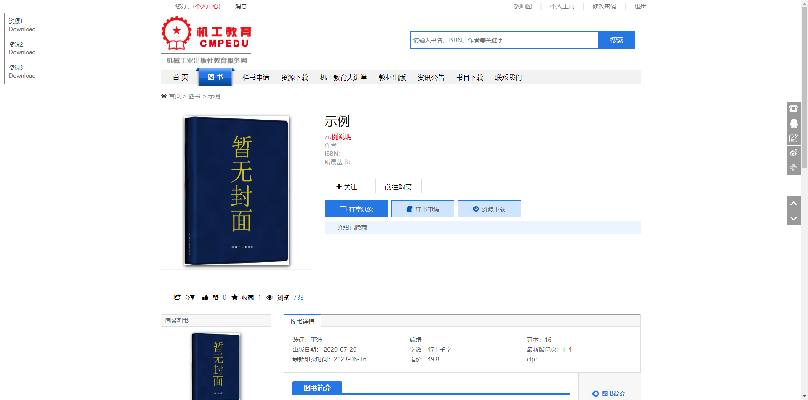

#  Cmpedu Resource Downloader

Cmpedu resource downloader, no login required, no instructor privileges needed.

## How to use

When you open, for example, `http://www.cmpedu.com/books/book/12345.htm` or `http://www.cmpedu.com/ziyuans/ziyuan/12345.htm` websites, the script program will automatically display the download link for the resource on the page, click the Download button to download.

[Online Download](https://greasyfork.org/zh-CN/scripts/483095-cmpedu-resource-downloader)

.

## Caution

**This program is intended for study and communication purposes only, and illegal use is prohibited. ** 

Please ensure that you use this program in compliance with relevant laws and regulations. Any misuse or illegal use is the personal responsibility of the user. The author is not responsible for misuse or illegal use.

If you choose to download this code, we encourage you to delete it within 24 hours. This is to ensure that you use the code for a limited time afterward to prevent abuse or illegal behavior.

## Infringement Contact

If you believe that a resource used in this program infringes your copyright or intellectual property rights, please contact us for removal by one of the following methods 

- Send an email to [this email address](mailto:yanyao@email.com)

- Submit an Issue on GitHub detailing the infringement

  

We will respond to your request as soon as possible and take appropriate steps to address the infringement.

