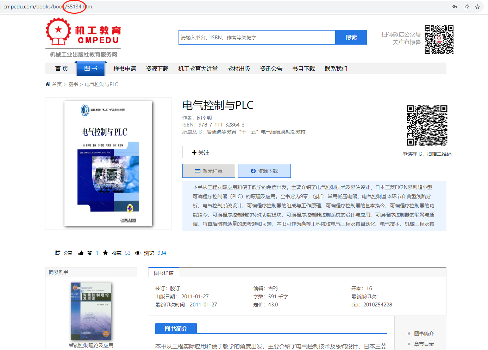

#  机工教育资源下载器

## 说明

机械工业出版社教育服务网资源下载器，无需登录，无需教师权限。

## 使用方法

1. 运行程序，输入 BOOK_ID。 
2. 程序将列出资源列表，输入你要下载的资源编号，用逗号分隔，例如：1,2。 
3. 选择资源后，程序会自动下载所选资源，如遇下载失败，请自行打开资源链接。

.

## 注意事项
**本程序仅供学习和交流目的使用，禁止违法使用。** 

请确保在遵守相关法律和规定的情况下使用此程序。任何滥用或违法使用由用户个人负责。作者对不当使用或违法行为概不负责。

如果您选择下载本代码，我们鼓励您在24小时内删除它。这是为了确保您使用代码后的时间有限，以防止滥用或违法行为。

## 侵权联系
如果您认为本程序使用的资源侵犯了您的版权或知识产权，请通过以下方式联系我们进行删除： 

- 发送电子邮件至 [该电子邮件地址](mailto:tripletu@email.com)

- 在 GitHub 上提交一个 Issue，详细说明侵权内容

  

我们将尽快回应您的请求并采取适当的措施以解决侵权问题。

